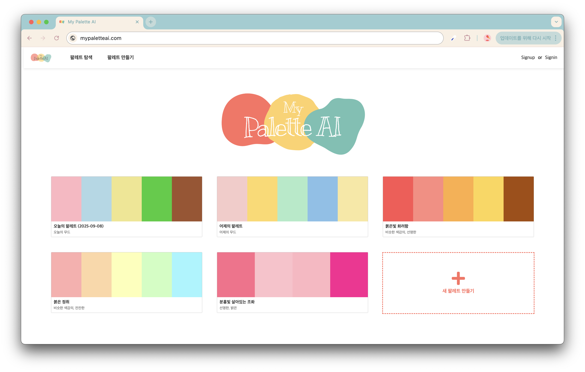
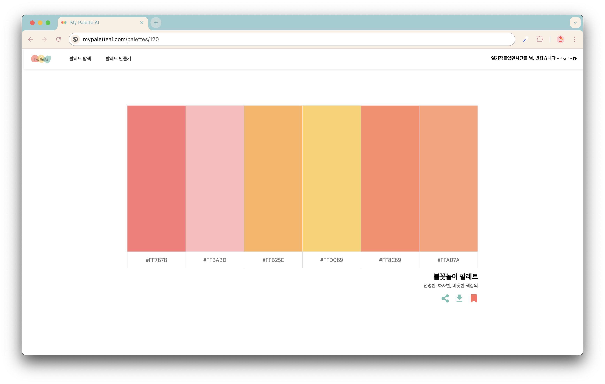

# 🎨 MyPaletteAI

<h3>개발자와 디자이너를 위한 색상 조합 팔레트 추천 및 제작 플랫폼</h3>

MyPaletteAI는 프로젝트 목적과 상황에 맞는 색상 조합을 추천하고, 사용자가 직접 팔레트를 탐색·제작할 수 있도록 설계한 웹 서비스입니다. 색상 선택에 어려움을 느낀 경험을 바탕으로, 개발자와 디자이너 모두에게 실질적인 도움이 되는 서비스를 목표로 프로젝트를 진행했습니다.

## 🔗 Live Demo
👉 https://mypaletteai.kr

## 🧪 Demo Account

테스트용 계정으로 로그인하여 서비스를 체험할 수 있습니다. 
(비밀번호 찾기는 본인 이메일로 가입시 체험 가능)
ID : test@mypaletteai.kr
PW : qwer1234!

# 🖼️ Preview

# 💡 주요기능
<h3>🎯 상황 기반 색상 팔레트 추천</h3>

● 사용 목적(웹, 앱, 브랜드, 포스터 등)에 따른 색상 팔레트 추천

● OpenAI API를 활용해 텍스트 입력 기반 팔레트 생성

● 중복도가 낮은 색상 조합을 제공하도록 프롬프트 설계

<h3>🔍 팔레트 탐색 기능</h3>

● 다양한 색상 조합을 직접 탐색 가능

● 특정 색상 계열 중심의 탐색 UX 구현

<h3>🛠️ 사용자 팔레트 제작</h3>

● 사용자가 직접 색상을 선택해 팔레트 생성

● 생성된 팔레트 즉시 확인 및 수정 가능

<h3>🧭 사용자 경험 중심 UI</h3>

● 색상 결과를 한눈에 확인할 수 있는 화면 구성

● 실제 사용 흐름을 고려한 UI/UX 설계

